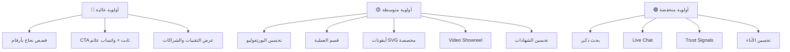

# 🔍 تقرير المقارنة الشامل: مشهور هب vs NahrDev

> تم إعداد هذا التقرير في **18 أبريل 2026** بعد فحص دقيق لكلا الموقعين

---

## 📋 ملخص تنفيذي

| المعيار | مشهور هب 🟢 | NahrDev 🔵 | الفائز |
|---------|------------|-----------|--------|
| **جودة التصميم العام** | ممتاز - داكن وعصري | جيد جداً - نظيف وعصري | 🟢 مشهور |
| **تجربة المستخدم (UX)** | جيدة جداً | جيدة | 🟢 مشهور |
| **غنى المحتوى** | ممتاز (44 مقالة + أكاديمية) | جيد (مدونة + قصص نجاح) | 🟢 مشهور |
| **عدد الخدمات** | 9 خدمات تفصيلية | 7 خدمات | 🟢 مشهور |
| **البنية ثنائية اللغة** | ✅ عربي + إنجليزي كامل | ✅ عربي + إنجليزي | 🟡 متعادل |
| **قصص النجاح/Portfolio** | 10 مشاريع + 3 case studies | قصص نجاح مفصلة بأرقام | 🔵 NahrDev |
| **نموذج التواصل** | نموذج ذكي (فردي/شركة) | نموذج بسيط وفعال | 🟢 مشهور |
| **التسعير** | ✅ صفحة تسعير | ❌ غير واضح | 🟢 مشهور |
| **SEO التقني** | ممتاز (Schema, OG, sitemap) | جيد | 🟢 مشهور |
| **الأنيميشن والتفاعلية** | جيد (particles + counters) | جيد (تأثيرات hover) | 🟡 متعادل |

---

## 🏗️ مقارنة الهيكلية والصفحات

### مشهور هب — خريطة الموقع الكاملة
```
📂 mashhor-hub.com
├── 🏠 الصفحة الرئيسية (EN + AR)
├── 📋 من نحن (About)
├── 📞 تواصل معنا (Contact)
├── ❓ الأسئلة الشائعة (FAQs)
├── 📁 الخدمات (9 صفحات تفصيلية)
│   ├── التصميم الجرافيكي
│   ├── التسويق عبر المؤثرين
│   ├── Mashhor AI
│   ├── الأتمتة الذكية
│   ├── التسويق الإلكتروني
│   ├── إنتاج الفيديو
│   ├── كتابة المحتوى
│   ├── تحسين محركات البحث
│   └── الاستشارات
├── 💼 الأعمال (Portfolio) — 10 مشاريع
├── 📊 دراسات حالة (Case Studies) — 3
├── 📝 المدونة — 44 مقالة
├── 🎓 الأكاديمية
├── 📚 المكتبة الرقمية
├── 🔧 أدوات التسويق
├── 💡 بنك البرومبتات
├── 💰 التسعير
├── 🤝 برنامج المؤثرين
├── 🎮 Game (تفاعلي)
├── 🔎 البحث
└── ⚖️ الشؤون القانونية
```

### NahrDev — خريطة الموقع
```
📂 nahrdev.com
├── 🏠 الصفحة الرئيسية (EN + AR)
├── 📋 معلومات عنا (About)
├── 📞 اتصال (Contact)
├── 📁 الخدمات (7 خدمات)
│   ├── التجارة الإلكترونية
│   ├── واجهة وتجربة المستخدم (UI/UX)
│   ├── التسويق عبر الإنترنت
│   ├── تطوير الويب
│   ├── تحسين محركات البحث
│   ├── تطبيق جوال
│   └── (صفحات فرعية أخرى)
├── 🏆 قصص النجاح
└── 📝 المدونة
```

> [!IMPORTANT]
> **مشهور هب يتفوق بشكل كبير في عمق المحتوى** — الموقع يحتوي على أكثر من ضعف عدد الصفحات والأقسام مقارنة بـ NahrDev. لكن NahrDev يتميز في **جودة عرض قصص النجاح بأرقام واضحة**.

---

## 🎨 المقارنة البصرية والتصميمية

### مشهور هب
````carousel

<!-- slide -->

<!-- slide -->

<!-- slide -->

````

### NahrDev
````carousel

<!-- slide -->

<!-- slide -->

<!-- slide -->

````

---

## ✅ نقاط القوة في مشهور هب (ما يتفوق فيه)

### 1. 📚 عمق المحتوى والموارد
- **44 مقالة مدونة** شاملة ومفصلة
- **أكاديمية تعليمية** كاملة
- **مكتبة رقمية** + **أدوات تسويق** + **بنك برومبتات**
- هذا يعطي الموقع قيمة مضافة هائلة لا تتوفر في NahrDev

### 2. 🤖 التكامل مع الذكاء الاصطناعي
- خدمة Mashhor AI مخصصة
- أتمتة ذكية وCloud workflows
- هذا يعطي ميزة تنافسية واضحة

### 3. 📝 نموذج التواصل الذكي
- تمييز بين العميل الفردي والشركة
- حقول ديناميكية حسب نوع العميل
- تفاصيل غنية (الميزانية، الجدول الزمني، الخدمات)

### 4. 💰 صفحة التسعير
- وجود صفحة تسعير واضحة يبني الثقة

### 5. 🧙 معالج نطاق المشروع (Project Scope Wizard)
- أداة تفاعلية فريدة تساعد العميل على اختيار الخدمة المناسبة
- مسار تحويل ذكي من 3 خطوات

### 6. 🔍 SEO التقني المتقدم
- Schema markup كامل
- Open Graph tags
- sitemap.xml + sitemap-images.xml
- robots.txt + hreflang tags
- ملفات llms.txt (للذكاء الاصطناعي)

### 7. 🛡️ البنية القانونية
- صفحات قانونية منفصلة
- توافق مع معايير الخصوصية

---

## ⚠️ ما ينقص مشهور هب (نقاط يتفوق فيها NahrDev)

### 1. 🏆 قصص النجاح بأرقام حقيقية
> [!WARNING]
> **أكبر نقصان في مشهور هب!** NahrDev يعرض قصص نجاح مع أرقام ونتائج محددة وملموسة.

**NahrDev يفعل:**
- زيادة المبيعات بنسبة X%
- تحسين معدل التحويل من X إلى Y
- عرض قبل وبعد بأرقام واضحة
- ربط كل قصة نجاح بخدمة محددة

**مشهور هب يفتقر لـ:**
- أرقام محددة في دراسات الحالة
- بيانات قبل/بعد واضحة
- ربط النتائج بالخدمات المقدمة

### 2. 📱 صفحات خدمات تطوير التطبيقات
- NahrDev لديه قسم واضح لـ **تطبيقات الجوال** و**تطوير الويب** كخدمات أساسية
- مشهور هب لا يركز بشكل كافٍ على خدمات التطوير البرمجي

### 3. 🎯 وضوح الخدمات التقنية
- NahrDev يعرض التقنيات المستخدمة بوضوح (React Native, Node.js, AWS)
- هذا يبني ثقة تقنية لدى العملاء

### 4. 🔍 شريط البحث في القائمة
- NahrDev لديه شريط بحث في القائمة الجانبية
- يسهل على المستخدم إيجاد ما يحتاج

### 5. 🎁 عرض استشارة مجانية ثابت
- NahrDev لديه زر "استشارة مجانية الآن" ثابت يظهر دائماً
- وزر واتساب عائم دائم

---

## 📊 مصفوفة المقارنة التفصيلية

### التصميم والتجربة البصرية

| العنصر | مشهور هب | NahrDev | التقييم |
|--------|---------|---------|---------|
| لوحة الألوان | أزرق داكن + ذهبي (فاخر) | أزرق فاتح + أبيض (نظيف) | مشهور أكثر فخامة |
| الطباعة | Alexandria + Space Grotesk | خطوط عربية مخصصة | كلاهما جيد |
| المساحات البيضاء | جيدة | ممتازة | NahrDev |
| الأيقونات | Emoji-based | أيقونات مخصصة | NahrDev |
| الصور | WebP محسنة | صور عالية الجودة | متعادل |
| تأثيرات الحركة | Particles + counters | Hover + scroll effects | متعادل |
| الاستجابة للموبايل | ✅ | ✅ | متعادل |

### المحتوى والخدمات

| العنصر | مشهور هب | NahrDev |
|--------|---------|---------|
| صفحات الخدمات | 9 صفحات مفصلة | 7 صفحات |
| المدونة | 44 مقالة | مدونة موجودة |
| الأكاديمية | ✅ كاملة | ❌ |
| المكتبة الرقمية | ✅ | ❌ |
| أدوات مجانية | ✅ | ❌ |
| قصص النجاح | 3 (بدون أرقام كافية) | ✅ (مع أرقام ونتائج) |
| Portfolio | 10 مشاريع | ✅ عرض مميز |
| الأسئلة الشائعة | ✅ صفحة كاملة | ❌ |
| التسعير | ✅ | ❌ |

### التقنيات والأداء

| العنصر | مشهور هب | NahrDev |
|--------|---------|---------|
| CRM مدمج | ✅ Google Sheets | غير واضح |
| PWA (Service Worker) | ✅ | ❌ |
| Schema Markup | ✅ شامل | ✅ أساسي |
| Sitemap | ✅ XML + HTML + Images | أساسي |
| UTM Tracking | ✅ | غير واضح |
| SSL | ✅ | ✅ |
| CDN | Vercel | غير واضح |

---

## 🚀 التوصيات العملية للتحسين (مرتبة حسب الأولوية)

### 🔴 أولوية عالية (تنفيذ فوري)

#### 1. تطوير قصص النجاح بأرقام حقيقية
> [!CAUTION]
> هذا هو **أهم تحسين** يمكن عمله. العملاء المحتملون يريدون رؤية نتائج ملموسة.

```diff
الوضع الحالي:
- "Mashhor Hub transformed our digital presence"
- "Our reach grew by 300%"

المطلوب:
+ 📊 زيادة المبيعات من 50K KWD إلى 200K KWD (300% نمو)
+ 📈 معدل التحويل ارتفع من 1.2% إلى 4.8%
+ 👥 نمو المتابعين من 5K إلى 45K في 3 أشهر
+ 💰 ROI: 12x على كل دينار مستثمر
+ 📉 تكلفة اكتساب العميل انخفضت 65%
```

**الخطوات العملية:**
- إضافة أرقام محددة لكل دراسة حالة
- إنشاء رسومات بيانية بصرية (قبل/بعد)
- إضافة timeline واضح لكل مشروع
- ربط كل قصة نجاح بالخدمات المستخدمة

#### 2. إضافة CTA ثابت (Sticky CTA)
```
مطلوب: زر "احجز استشارة مجانية" يظهر دائماً
+ Float button للواتساب
+ Sticky bar في أسفل الشاشة على الموبايل
```

#### 3. تحسين عرض التقنيات والأدوات
```
إضافة قسم يعرض:
+ شعارات التقنيات المستخدمة (Meta, Google, TikTok, AI tools)
+ شهادات وشراكات رسمية
+ أدوات الذكاء الاصطناعي المستخدمة
```

---

### 🟡 أولوية متوسطة (خلال شهر)

#### 4. تحسين صفحات البورتفوليو
- إضافة أرقام ونتائج لكل مشروع
- إضافة صور قبل/بعد
- إضافة فلترة حسب الصناعة أو الخدمة
- إضافة تأثيرات hover أكثر تفاعلية

#### 5. إضافة قسم "العملية" (Process Section)
```
خطوات العمل المرئية:
1. 🎯 الاكتشاف والتحليل
2. 📋 بناء الاستراتيجية
3. 🚀 التنفيذ والإطلاق
4. 📊 القياس والتحسين
```
NahrDev يعرض هذا بشكل واضح، وهو يبني ثقة كبيرة لدى العملاء

#### 6. تحسين الأيقونات
- استبدال Emoji بأيقونات SVG مخصصة احترافية
- إنشاء نظام أيقونات موحد يتماشى مع الهوية البصرية

#### 7. إضافة Video Showreel
- فيديو قصير (60-90 ثانية) يعرض أبرز الأعمال
- يضاف في الصفحة الرئيسية أو صفحة "من نحن"

#### 8. تحسين قسم الشهادات (Testimonials)
```diff
الوضع الحالي:
- أحرف عربية كـ avatar
- نص فقط

المطلوب:
+ صور حقيقية للعملاء (أو شعارات شركاتهم)
+ تقييم بالنجوم
+ فيديو شهادات
+ ربط كل شهادة بدراسة حالة
```

---

### 🟢 أولوية منخفضة (تحسينات مستقبلية)

#### 9. إضافة شريط بحث ذكي
- بحث سريع في القائمة الرئيسية
- نتائج فورية أثناء الكتابة
- فلترة حسب الأقسام

#### 10. إضافة Live Chat أو Chatbot
- بوت ذكاء اصطناعي للرد الفوري
- ربط مع الواتساب

#### 11. تحسين صفحة 404
- إضافة بحث في صفحة 404
- اقتراحات صفحات ذات صلة

#### 12. إضافة قسم الأسئلة الشائعة في الصفحة الرئيسية
- FAQ مختصر (3-5 أسئلة) في الصفحة الرئيسية
- مع تأثير accordion تفاعلي

#### 13. تحسين الأداء
- إضافة Critical CSS inline
- تحسين Largest Contentful Paint (LCP)
- تقليل حجم JavaScript

#### 14. إضافة Trust Signals أكثر
```
+ شعارات منصات الدفع
+ شهادات أمان
+ عداد عملاء لحظي
+ تقييمات Google Reviews
```

#### 15. Dark/Light Mode Toggle
- إضافة خيار تبديل بين الوضع الداكن والفاتح

---

## 📈 ملخص الأولويات



---

## 🏁 الخلاصة

> [!TIP]
> **مشهور هب يتفوق بوضوح** على NahrDev في عمق المحتوى، تنوع الخدمات، والبنية التقنية. لكن NahrDev يتفوق في **عرض النتائج الملموسة وقصص النجاح المدعومة بأرقام**.

### التحسينات الثلاثة الأهم التي يجب تنفيذها فوراً:

1. **🏆 تطوير قصص النجاح والدراسات بأرقام حقيقية** — هذا وحده سيرفع معدل التحويل بشكل ملحوظ
2. **📌 إضافة CTA ثابت وزر واتساب عائم** — لتسهيل التواصل الفوري
3. **🔧 تحسين عرض الخدمات بالتقنيات والنتائج** — لبناء ثقة تقنية أكبر

*النتيجة: مشهور هب في موقع قوي جداً ويحتاج فقط تحسينات تكتيكية للوصول لمستوى عالمي.*

---

## 🎬 تسجيل فيديو لتصفح NahrDev


